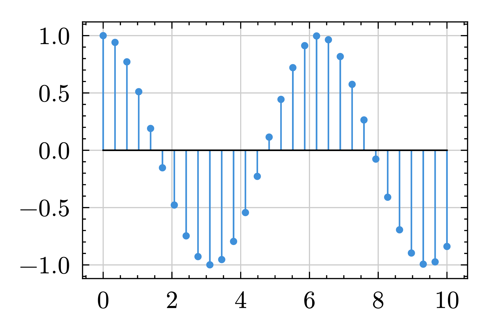

I have a course called "Signals and Systems" this term. As the name suggests, this is a course that studies Signals and Systems. To better describe signals, discrete, ~~concrete~~ continuous, we draw diagrams.



In order to complete the assignments for this course, I would need some typesetting tools. My choices are:

- **Pen & Paper.** Simple, yet powerful. The only limitation is your imagination. Zero compatibility layer between your mind and your work. The way how the ancient masters do it.

  Cannot be pushed to GitHub to make up my commit counts? **Meh.**

- **$\LaTeX$.** La Typesetting Essential X.

  `3.5GiB` for the full toolkit? 30 lines of code for a plot? **Meh.**

- **Markdown.** Feather weight markup language. Brilliantly stolen the Math subset from $\LaTeX$.

  No plotting at all? **Meh.**

The biggest problem with these tools is drawing diagrams.

Let's first add a simple `solution` environment.

```typst
#let solution(body) = block(width: 100%, inset: 8pt)[
  *_Solution._* #body
]
```

Such concise and elegant code! ...well, perhaps we've poured too much into the "consice" glass. But that's nothing to blame, for `solution`s are just that simple. To 
